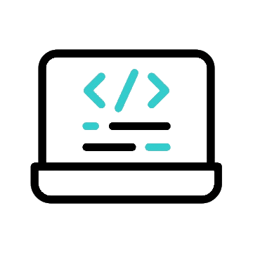

  
  <h3 align="center">Hey there, I'm <a href="https://carrillo.asynclogic.net/">Freddy</a>!!
    
  </h3>

## <picture></picture> About me

<picture> </picture>

 

- :computer: I am a passionate Software Engineer with experience in developing web and mobile applications. My professional focus is on creating modern, functional and scalable solutions.
- :computer: I love to continuously learn, develop impactful projects and share my knowledge with the community, whether developing educational projects or solving technical challenges.
 

## <picture>   </picture> Skills

<table>
  <tr>
    <td align="center">
      ReactJS
        
      <a href="#" target="_blank">
        
         
        (Ver certificado)
      </a>
    </td>
    <td align="center">
      NextJS
        
      <a href="https://cursos.devtalles.com/certificates/xyfwmdfxit" target="_blank">
        
         
        (Ver certificado)
      </a>
    </td>
    <td align="center">
      TypeScript
        
      <a href="https://cursos.devtalles.com/certificates/zqowpwnpdz" target="_blank">
        
         
        (Ver certificado)
      </a>
    </td>
    <td align="center">
      NodeJS
        
      <a href="https://www.udemy.com/certificate/UC-a3f39d08-3261-47ec-8ebe-be60f15e9b48/" target="_blank">
        
         
        (Ver certificado)
      </a>
    </td>
    <td align="center">
      AWS Serverless
        
      <a href="https://www.udemy.com/certificate/UC-a3f39d08-3261-47ec-8ebe-be60f15e9b48/" target="_blank">
        
         
        (Ver certificado)
      </a>
    </td>
    <td align="center">
      Laravel
        
      <a href="#" target="_blank">
        
         
        (Ver certificado)
      </a>
    </td>
    <td align="center">
      React Native
        
      <a href="#" target="_blank">
        
         
        (Ver certificado)
      </a>
    </td>
  </tr>
</table>